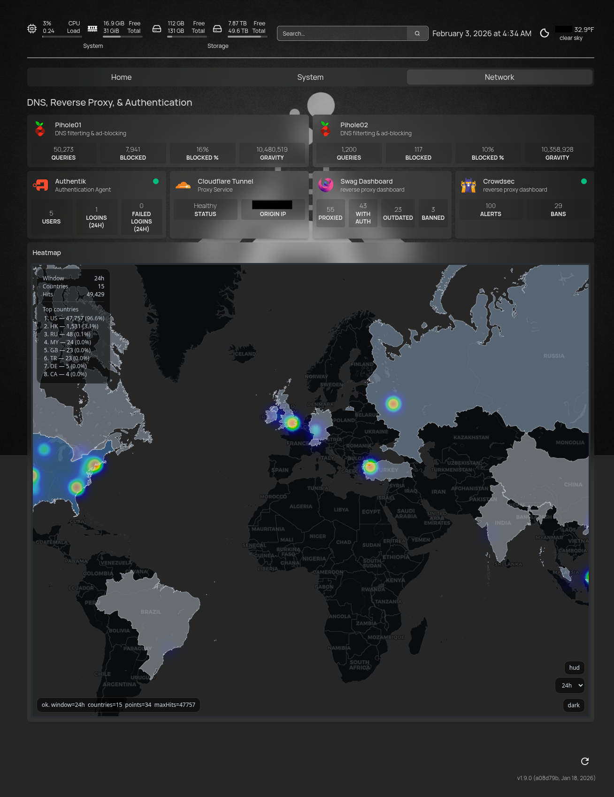
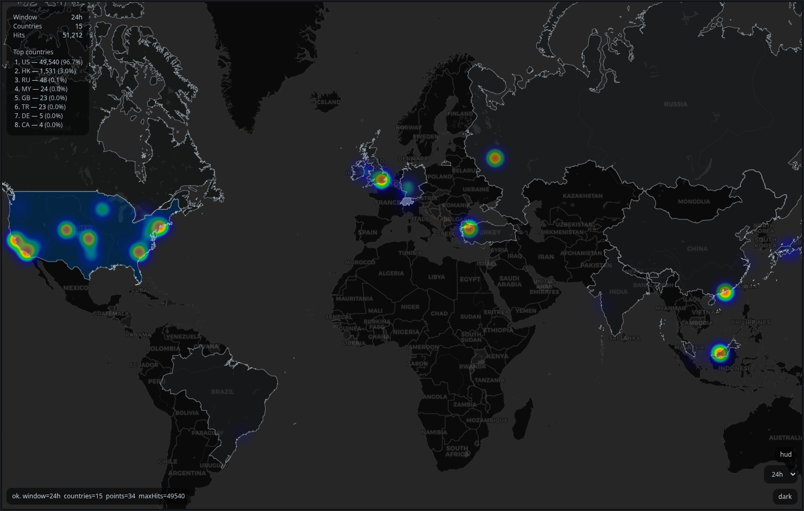
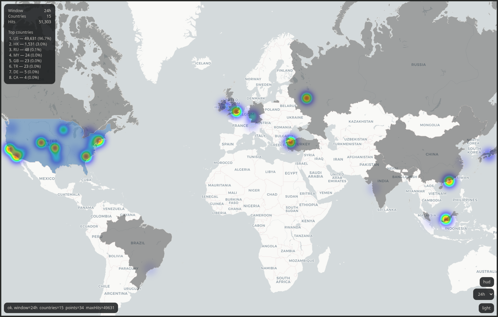

---
WIP: project under active development.
---

Provides a lightweight GeoIP-derived geospatial heatmap viewer that can be embedded into the [Homepage](https://github.com/gethomepage/homepage) dashboard. The intent is to use GeoIP access log data stored in InfluxDB v1 (via the SWAG GeoIP tooling / mods) and render it as a standalone map view.

**NOT** designed to be exposed publicly without auth.

## Prerequisites
- **GetHomepage** dashboard docker container
- Linuxserver.io's **SWAG (Secure Web Application Gateway)** docker container
- Linuxserver.io's **geoip2influxdb docker mod** (fully configured)
- Linuxserver.io's **maxmind docker mod** (fully configured)

## Usage

Launch docker container:

```yaml
  homepage-geoip-heatmap:
    image: ghcr.io/princinv/homepage-geoip-heatmap:latest
    container_name: homepage-geoip-heatmap
    user: "1000:1000"
    privileged: false
    secrets:
      - source: influxdbv1_pass
        target: influxdbv1_pass
        mode: 0o400
    environment:
      INFLUX_HOST: "${INFLUXDBv1_HOST}"
      INFLUX_HOST_PORT: "8086"
      INFLUX_DATABASE: "${INFLUXDBv1_GEOIP_DB}"
      INFLUX_USER: "${INFLUXDBv1_USER}"
      INFLUX_PASS_FILE: "/run/secrets/influxdbv1_pass"
      GEO_MEASUREMENT: "geoip2influx"
      HEATMAP_TIME_WINDOW: "24h"
      HEATMAP_REFRESH_SECONDS: "30"
      HEATMAP_CACHE_SECONDS: "30"
      HEATMAP_MAX_POINTS: "20000"
      # HEATMAP_TITLE: "GeoIP Heatmap"
      THEME_MODE: "auto"
      PUID: "1000"
      PGID: "1000"
      APP_PORT: "8000"
      DEBUG: "false"
    read_only: false
    volumes:
      - "/etc/timezone:/etc/timezone:ro"
      - "/etc/localtime:/etc/localtime:ro"
    # Must share a network with InfluxDB and with SWAG.
    networks:
      - "proxy-net"
    ports:
      - "8000:8000"
    healthcheck:
      test: ["CMD", "python", "-c", "import urllib.request; urllib.request.urlopen('http://127.0.0.1:8000/healthz').read()"]
      interval: 30s
      timeout: 10s
      retries: 5
    logging:
      driver: "json-file"
      options:
        mode: "non-blocking"
        max-size: "10m"
        max-file: 5 
    restart: "unless-stopped"
    depends_on:
      swag:
        condition: service_healthy
```

In GetHomepage's `services.yaml` (example):

```yaml
- GeoIP:
    - Heatmap:
        href: https://geoip.your.domain
        widget:
          type: iframe
          name: swagMap
          src: https://geoip.your.domain
          allowScrolling: yes
          classes: h-screen sm:h-screen md:h-screen lg:h-screen xl:h-screen 2xl:h-screen
```

In GetHomepage's `settings.yaml` (example):

```yaml
  GeoIP:
    header: false
    tab: Network
    style: row
    columns: 1
    initiallyCollapsed: false
    target: _blank
```

## Features
- Time window selector
- Country-level *tooltip* displaying hits as an absolute number and as a percentage of total hits.
- Dark/light mode toggle
- HUD featuring time window, total visitor countries, total hits, and lists the top 8 countries. 
- Query parameters
  - window (optional)
    - Applies to: `GET /data` and `GET /data/countries`
    - Example: `/data?window=6h`, `/data/countries?window=7d`
    - Format: duration string matching `^[0-9]+(ms|s|m|h|d|w)$` (e.g. `1h`, `24h`, `7d`)
    - If invalid or missing, falls back to `HEATMAP_TIME_WINDOW` (default `24h`)
  - mode (optional, frontend-only)
    - Applies to: `index.html` UI behavior (not the API)
    - Example: `/?mode=clean`, `/?mode=full`, `/?mode=map-only`
    - Behavior:
      - `clean`: hides debug + toggles (minimal chrome)
      - `full`: shows full UI (debug/toggles/HUD placeholders)
      - `map-only`: intended for embedded/readonly display (UI hidden; map interactions can be disabled)

## Screenshots
<table>
  <tr>
    <td style="vertical-align: top; width: 50%;">
      
    </td>
    <td style="vertical-align: top; width: 50%;">
      
      <br>
      
    </td>
  </tr>
</table>

## Environment
| Variable | Default | Notes |
|---|---:|---|
| `INFLUX_HOST` | `influxdb` | InfluxDB hostname/service name reachable **inside** the Docker network. |
| `INFLUX_HOST_PORT` | `8086` | InfluxDB HTTP API port **inside** the Docker network (commonly `8086`). |
| `INFLUX_DATABASE` | `geoip2influx` | InfluxDB database containing GeoIP data (yours is `geoip2influx`). |
| `INFLUX_USER` | `influxer` | Optional if auth disabled. |
| `INFLUX_PASS_FILE` | `/run/secrets/influxdb_pass` | **Preferred.** |
| `INFLUX_PASS` | *(unset)* | Compatibility option. |
| `GEO_MEASUREMENT` | `geoip2influx` | Measurement name (default is `geoip2influx`). |
| `HEATMAP_TIME_WINDOW` | `24h` | Influx duration window to query (e.g. `1h`, `24h`, `7d`). |
| `HEATMAP_REFRESH_SECONDS` | `30` | Browser refresh interval (seconds). |
| `HEATMAP_CACHE_SECONDS` | `30` | Server-side caching for `/data` (seconds). |
| `HEATMAP_MAX_POINTS` | `20000` | Optional; safety cap for returned points. |
| `HEATMAP_TITLE` | *(absent)* | Optional; title; omit or leave blank for none. |
| `THEME_MODE` | `auto` | Optional; set dark/light mode deterministically. |
| `PUID` | *1000* | Optional |
| `PGID` | *1000* | Optional |
| `APP_PORT` | *8000* | Optional; specify internal listening port. |
| `DEBUG` | *false* | Optional |

## Credits / Upstream Projects
This project is intended to be used alongside the following upstream projects:

- Homepage (dashboard): https://github.com/gethomepage/homepage
- SWAG (reverse proxy): https://github.com/linuxserver/docker-swag
- linuxserver.io SWAG dashboard / Geoip2influxdb ecosystem: https://github.com/linuxserver/docker-mods
- InfluxDB v1 (time series backend): https://github.com/influxdata/influxdb

## Roadmap
- [x] ~~Highlight country~~
- [x] ~~Set `minZoom` and `maxBounds` and optionally `WorldCopyJump`~~
- [x] ~~Add border~~
- [x] ~~Add dark/light mode (`preferred-color-scheme` + toggle + env var)~~
- [x] ~~Add time window selector~~
- [x] ~~Add country-level *tooltip* (hits w/ percentage)~~
- [x] ~~Add query params for broader reusability (grafana/other dashboards)~~
  - ~~`?mode=clean` → no labels, no HUD~~
  - ~~`?mode=full` → HUD + legend + stats~~
  - ~~`?mode=map-only`~~
- [x] ~~Add HUD overlay (visitors, hits, top countries, etc.) at `/data/countries`~~
- [ ] Create full compose example (minimal swag + homepage + influxdb + heatmap)
- [ ] Move away from CDN eventually (self-host JS/CSS by vendoring them into `/static/vendor/...`

## SCRATCH
- lat and long stored as tags not fields, only field is `COUNT`
- add certificate expiration?
- add heatmap intensity toggle?
- slider biases rendering toward city heat (radius/opacity up) or country choropleth (fillOpacity up)?
- legend + scale?
