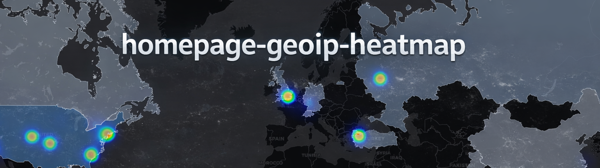

---
WIP: project under active development.
---

Provides a lightweight GeoIP-derived geospatial heatmap viewer that can be embedded into the [Homepage](https://github.com/gethomepage/homepage) dashboard. The intent is to use GeoIP access log data stored in InfluxDB v1 (via the SWAG GeoIP tooling / mods) and render it as a standalone map view.

**NOT** designed to be exposed publicly without auth.

## Prerequisites
- **GetHomepage** dashboard docker container
- Linuxserver.io's **SWAG (Secure Web Application Gateway)** docker container
- Linuxserver.io's **geoip2influxdb docker mod** (fully configured)
- Linuxserver.io's **maxmind docker mod** (fully configured)

## Environment
| Variable | Default | Notes |
|---|---:|---|
| `INFLUX_HOST` | `influxdb` | InfluxDB hostname/service name reachable **inside** the Docker network. |
| `INFLUX_HOST_PORT` | `8086` | InfluxDB HTTP API port **inside** the Docker network (commonly `8086`). |
| `INFLUX_DATABASE` | `geoip2influx` | InfluxDB database containing GeoIP data (yours is `geoip2influx`). |
| `INFLUX_USER` | `influxer` | Optional if auth disabled. |
| `INFLUX_PASS_FILE` | `/run/secrets/influxdb_pass` | **Preferred.** |
| `INFLUX_PASS` | *(unset)* | Compatibility option. |
| `GEO_MEASUREMENT` | `geoip2influx` | Measurement name (default is `geoip2influx`). |
| `HEATMAP_TIME_WINDOW` | `24h` | Influx duration window to query (e.g. `1h`, `24h`, `7d`). |
| `HEATMAP_REFRESH_SECONDS` | `30` | Browser refresh interval (seconds). |
| `HEATMAP_CACHE_SECONDS` | `30` | Server-side caching for `/data` (seconds). |
| `HEATMAP_MAX_POINTS` | `20000` | Optional; safety cap for returned points. |
| `HEATMAP_TITLE` | *(absent)* | Optional; title; omit or leave blank for none. |
| `THEME_MODE` | `auto` | Optional; set dark/light mode deterministically. |
| `PUID` | *1000* | Optional |
| `PGID` | *1000* | Optional |
| `APP_PORT` | *8000* | Optional; specify internal listening port. |
| `DEBUG` | *false* | Optional |

## Credits / Upstream Projects
This project is intended to be used alongside the following upstream projects:

- Homepage (dashboard): https://github.com/gethomepage/homepage
- SWAG (reverse proxy): https://github.com/linuxserver/docker-swag
- linuxserver.io SWAG dashboard / Geoip2influxdb ecosystem: https://github.com/linuxserver/docker-mods
- InfluxDB v1 (time series backend): https://github.com/influxdata/influxdb

# ROADMAP
- [x] Highlight country
- [x] Set `minZoom` and `maxBounds` and optionally `WorldCopyJump`
- [x] Add border
- [ ] Add dark/light mode (`preferred-color-scheme` + toggle + env var)
- [ ] Add HUD overlay (visitors, hits, top countries, etc.) at `/data/countries`
- [ ] Add time window selector
- [ ] Add country-level *tooltip* (hits w/ percentage)
- [ ] Create full compose example (minimal swag + homepage + influxdb + heatmap)
- [ ] Move away from CDN eventually (self-host JS/CSS by vendoring them into `/static/vendor/...`

## SCRATCH
- lat and long stored as tags not fields, only field is `COUNT`
- add certificate expiration?
- add heatmap intensity toggle?
- slider biases rendering toward city heat (radius/opacity up) or country choropleth (fillOpacity up)
- legend + scale
- Add query params for broader reusability (grafana/other dashboards)
  - `?mode=clean` → no labels, no HUD
  - `?mode=full` → HUD + legend + stats
  - `?mode=map-only`
